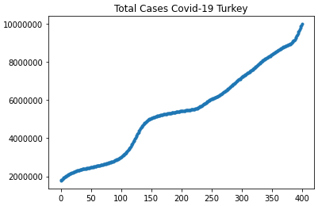
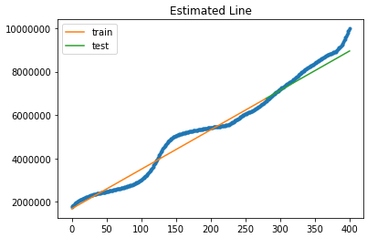
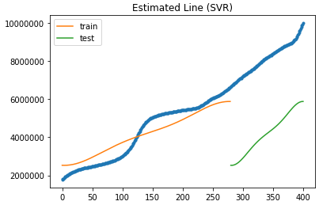
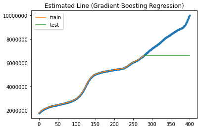
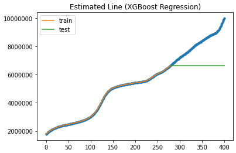
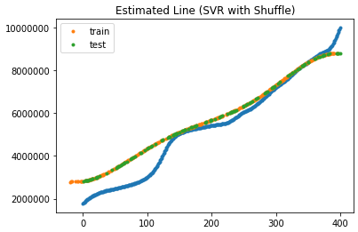
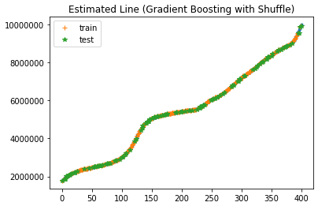
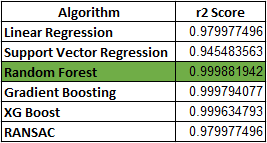

# Covid_Regressor_Comparison
 Used Turkey's covid data to compare different regression methods. 

 Used Regressions: Random Forest, Support Vector Mavhine, Logistic Regression, XG Boost, Gradient Boosting Regression and RANSAC.

## Total Cases Covid-19 Turkey

## Linear Regresison Estimated Line

## SVR Estimated Line

## Random Forest Estimated Line

## Gradient Boosting Estimated Line

## XGBoost Estimated Line

## Ransac Estimated Line

The reason for some of the regressors to predict a straight line is because they these regressors require a homogeneous input data to train. Since these estimated lines are without shuffling the data in the process of splitting to train and test. Lets look at the estimated lines with the shuffled data.

## Linear Regression With Shuffle Estimated Line

## SVR With Shuffle Estimated Line

## Random Forest With Shuffle Estimated Line

## Gradient Boosting With Shuffle Estimated Line

## XGBoost With Shuffle Estimated Line

## Ransac With Shuffle Estimated Line

# Conclulsion

As we can see from the estimated line graphs, when the data is homogeneous the results we got are pretty good. This time we can see that other regression types surpasses the Linear Regression by a lot. The winning regression is the Random Forest Regression according to the r2 scores gained by each of the regressions. 

